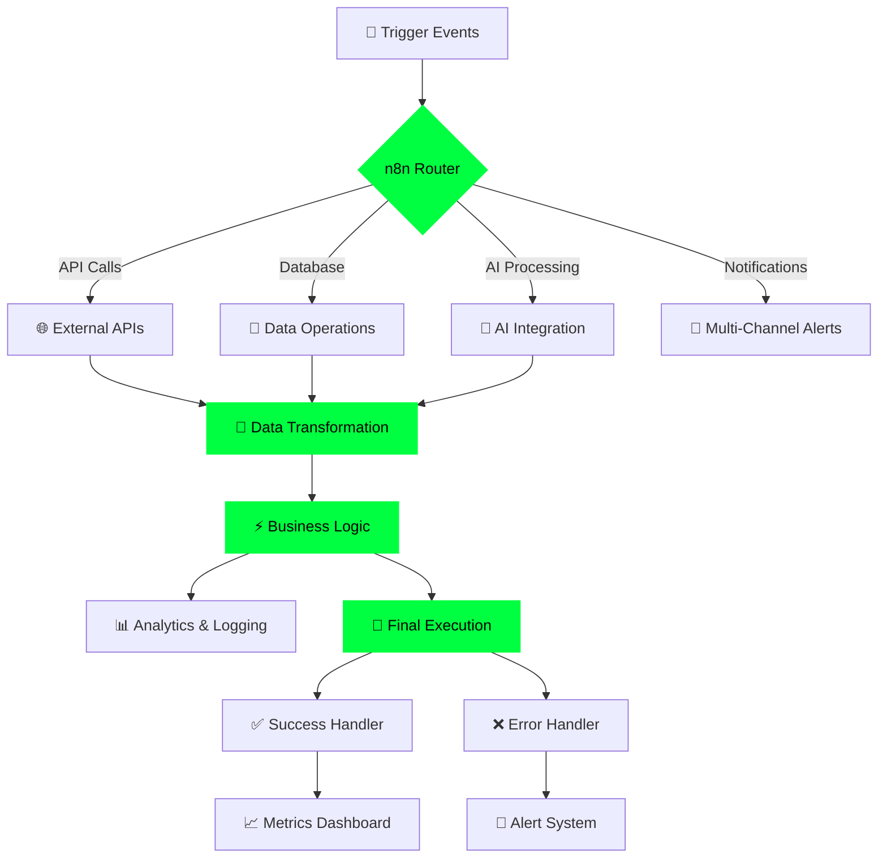

<div align="center">

# 🌐 WELCOME TO THE BLOCKCHAIN 🌐


<br>

```solidity
// SPDX-License-Identifier: MIT
pragma solidity ^0.8.0;

contract MinhDucProfile {
    
    struct Developer {
        string name;
        string location;
        string role;
        string[] skills;
        mapping(string => bool) expertise;
    }
    
    Developer public dev;
    
    constructor() {
        dev.name = "Minh Duc";
        dev.location = "Ha Noi, Vietnam 🇻🇳";
        dev.role = "Fullstack Developer & Automation Specialist";
        
        dev.expertise["Web3"] = true;
        dev.expertise["Blockchain"] = true;
        dev.expertise["DeFi"] = true;
        dev.expertise["Smart Contracts"] = true;
        dev.expertise["Automation"] = true;
    }
    
    function getSkills() public pure returns (string[] memory) {
        string[] memory skills = new string[](7);
        skills[0] = "Java";
        skills[1] = "JavaScript/React.js";
        skills[2] = "TailwindCSS";
        skills[3] = "Prisma";
        skills[4] = "n8n Automation";
        skills[5] = "Web3 Development";
        skills[6] = "Smart Contracts";
        return skills;
    }
    
    function getMotto() public pure returns (string memory) {
        return "No money no problem, no ChatGPT big problem";
    }
}
```

<br>


<br>

[](https://github.com/minhducdz99)
[](mailto:minhduc2510.work@gmail.com)
[](YOUR_FACEBOOK_LINK)
[](https://twitter.com/stormz9081)
[](https://zalo.me/0368424724)

<br>


<br>

---

### 💫 *"Transforming ideas into decentralized reality, one block at a time"*

---

</div>

<br>

## 🎯 WHO AM I?

```typescript
interface Developer {
  name: string;
  location: string;
  role: string;
  passions: string[];
  currentMission: string;
}

const minhDuc: Developer = {
  name: "Minh Duc",
  location: "Ha Noi, Vietnam 🇻🇳",
  role: "Fullstack Developer & Automation Architect",
  passions: [
    "🔗 Blockchain & Web3 Technologies",
    "⚡ Building Scalable Applications", 
    "🤖 Workflow Automation & AI Integration",
    "💡 Creating Innovative Solutions",
    "🌍 Decentralized Finance (DeFi)"
  ],
  currentMission: "Building the future of decentralized applications"
};

// Life Philosophy
console.log("No money no problem, no ChatGPT big problem 😄");

// Contact
const contact = {
  email: "minhduc2510.work@gmail.com",
  zalo: "0368424724",
  available: true
};
```

<br>

<div align="center">

## ⚡ TECH ARSENAL


### 💻 Languages & Core

<table>
<tr>
<td align="center" width="96">

<br>Java
</td>
<td align="center" width="96">

<br>JavaScript
</td>
<td align="center" width="96">

<br>TypeScript
</td>
<td align="center" width="96">

<br>HTML5
</td>
<td align="center" width="96">

<br>CSS3
</td>
<td align="center" width="96">

<br>Solidity
</td>
</tr>
</table>

### 🎨 Frontend Development

<table>
<tr>
<td align="center" width="96">

<br>React
</td>
<td align="center" width="96">

<br>Tailwind
</td>
<td align="center" width="96">

<br>Next.js
</td>
<td align="center" width="96">

<br>Vite
</td>
</tr>
</table>

### ⚙️ Backend & Database

<table>
<tr>
<td align="center" width="96">

<br>Node.js
</td>
<td align="center" width="96">

<br>Prisma
</td>
<td align="center" width="96">

<br>PostgreSQL
</td>
<td align="center" width="96">

<br>MongoDB
</td>
</tr>
</table>

### 🔗 Web3 & Blockchain

<table>
<tr>
<td align="center" width="96">

<br>Ethereum
</td>
<td align="center" width="96">

<br>Web3.js
</td>
<td align="center" width="96">

<br>Contracts
</td>
<td align="center" width="96">

<br>DeFi
</td>
</tr>
</table>

### 🛠️ Tools & DevOps

<table>
<tr>
<td align="center" width="96">

<br>Git
</td>
<td align="center" width="96">

<br>GitHub
</td>
<td align="center" width="96">

<br>VS Code
</td>
<td align="center" width="96">

<br>Docker
</td>
</tr>
</table>

<br>


</div>

<br>

## 🤖 N8N AUTOMATION MASTERY

<div align="center">


### *"Automate Everything, Code Nothing"*

</div>

```yaml
n8n_expertise:
  level: "Expert"
  workflows_created: "50+"
  specializations:
    - Complex Workflow Orchestration
    - Multi-API Integration & Synchronization
    - Real-time Data Processing Pipelines
    - Intelligent Chatbot Development
    - Email Marketing Automation
    - Database Operations & ETL
    - Webhook & Event-Driven Architecture
    - AI/ML Integration (ChatGPT, Claude, etc.)
    - CRM & Business Process Automation
    - Social Media Management Automation
    
  integrations:
    apis: ["REST", "GraphQL", "WebSocket"]
    databases: ["PostgreSQL", "MongoDB", "MySQL", "Redis"]
    platforms: ["Telegram", "Discord", "Slack", "Email", "SMS"]
    ai_tools: ["OpenAI", "Claude", "Gemini", "Stable Diffusion"]
    web3: ["Ethereum", "Smart Contracts", "Wallet Operations"]
```

<div align="center">

### 🔄 Automation Workflow Architecture



### 💡 Automation Capabilities

| Category | Skills | Impact |
|:--------:|:------:|:------:|
| 🔗 **Integration** | 100+ API Connectors | Seamless Data Flow |
| ⚡ **Performance** | Real-time Processing | < 100ms Response |
| 🛡️ **Reliability** | Error Handling & Retry | 99.9% Uptime |
| 📊 **Scale** | 10K+ Operations/Day | Enterprise Ready |
| 🎯 **Precision** | Advanced Logic Trees | Zero Data Loss |

<br>


</div>

<br>

## 📊 GITHUB ANALYTICS

<div align="center">


<br><br>


<br><br>


<br><br>

### 🏆 ACHIEVEMENTS


<br>

### 📈 CONTRIBUTION GRAPH

[](https://github.com/minhducdz99)

<br>

### 🐍 CONTRIBUTION SNAKE


<br>


</div>

<br>

## 💼 CURRENT STATUS

<div align="center">

<table>
<tr>
<td width="50%" valign="top">

### 🎯 Focus Areas

```bash
$ cat /dev/focus
━━━━━━━━━━━━━━━━━━━━━━━━━━━
🔹 Building DeFi Applications
🔹 Smart Contract Development  
🔹 Web3 Integration Solutions
🔹 Advanced n8n Workflows
🔹 Full-stack Development
━━━━━━━━━━━━━━━━━━━━━━━━━━━
```

### 🌱 Currently Learning

```javascript
const learning = {
  advanced: [
    "Solidity Gas Optimization",
    "DeFi Protocol Architecture",
    "Zero-Knowledge Proofs",
    "Layer 2 Solutions"
  ],
  expanding: [
    "Rust for Blockchain",
    "GraphQL Advanced Patterns",
    "Microservices Architecture"
  ]
};
```

</td>
<td width="50%" valign="top">


### 🎓 Expertise Level

```
Smart Contracts    ████████░░ 80%
Web3 Development   ███████░░░ 70%
n8n Automation     ██████████ 95%
React.js           █████████░ 85%
Backend APIs       ████████░░ 80%
Database Design    ████████░░ 75%
```

</td>
</tr>
</table>

</div>

<br>

## 🌟 PHILOSOPHY & APPROACH

<div align="center">

```ascii
╔══════════════════════════════════════════════════════════════╗
║                                                              ║
║   "Code is poetry, blockchain is freedom,                   ║
║    and automation is the bridge between them."              ║
║                                                              ║
║   🎯 Problem Solver  |  💡 Innovation Seeker                ║
║   🤝 Team Player     |  📚 Continuous Learner               ║
║   🚀 Result Driven   |  🌍 Global Mindset                   ║
║                                                              ║
╚══════════════════════════════════════════════════════════════╝
```

</div>

### 💭 Core Values

<table>
<tr>
<td width="33%" align="center">

<h4>🎨 Innovation</h4>
<i>Pushing boundaries with<br>creative solutions</i>
</td>
<td width="33%" align="center">

<h4>⚡ Efficiency</h4>
<i>Automation first,<br>manual never</i>
</td>
<td width="33%" align="center">

<h4>🤝 Collaboration</h4>
<i>Building together,<br>winning together</i>
</td>
</tr>
</table>

<br>

## 📞 LET'S CONNECT

<div align="center">


<br><br>

```ascii
┏━━━━━━━━━━━━━━━━━━━━━━━━━━━━━━━━━━━━━━━━━━━━━━━━━━━━━━┓
┃                                                      ┃
┃   💬 Open for collaborations, freelance projects,   ┃
┃      and interesting blockchain opportunities!       ┃
┃                                                      ┃
┗━━━━━━━━━━━━━━━━━━━━━━━━━━━━━━━━━━━━━━━━━━━━━━━━━━━━━━┛
```

<br>

### 📬 Get In Touch

[](mailto:minhduc2510.work@gmail.com)
[](YOUR_FACEBOOK_LINK)
[](https://twitter.com/stormz9081)
[](https://zalo.me/0368424724)

<br>

### 📍 Location & Availability

```javascript
const availability = {
  location: "📍 Ha Noi, Vietnam",
  timezone: "GMT+7 (ICT)",
  workingHours: "Flexible",
  responseTime: "< 24 hours",
  openTo: ["Remote Work", "Freelance", "Collaboration", "Full-time"],
  languages: ["Vietnamese (Native)", "English (Professional)"]
};
```

<br>

### 💌 Response Time

| Channel | Response Time | Best For |
|:-------:|:-------------:|:--------:|
| 📧 Email | < 24 hours | Professional inquiries |
| 💬 Zalo | < 2 hours | Quick questions |
| 🐦 Twitter | < 12 hours | Public discussions |
| 📘 Facebook | < 6 hours | Casual conversations |

<br>


</div>

<br>

## 🎯 QUICK STATS

<div align="center">


</div>

<br>

<div align="center">

```javascript
// Thanks for visiting my profile! 
const thanks = () => {
  console.log("🚀 Keep building!");
  console.log("💚 Keep learning!");  
  console.log("🌟 Keep innovating!");
  console.log("\n⭐ Don't forget to star interesting repos!");
};

thanks();
```

<br>


<br>

**💚 Made with passion and blockchain vibes by [Minh Duc](https://github.com/minhducdz99)**

*"No money no problem, no ChatGPT big problem" - 2025*

</div>
