<div align="center">

# 🌐 WELCOME TO THE BLOCKCHAIN 🌐


<br>

## 🎯 WHO AM I?

<table>
<tr>
<td width="50%">

### 👤 Profile

- 🏷️ **Name:** Minh Duc
- 📍 **Location:** Ha Noi, Vietnam 🇻🇳
- 💼 **Role:** Fullstack Developer & Automation Expert
- 📧 **Email:** minhduc2510.work@gmail.com
- 💬 **Zalo:** 0368424724

### 🚀 Current Mission

Building decentralized applications and automating the future, one workflow at a time.

### 💭 Philosophy

*"No money no problem, no ChatGPT big problem"* 😄

</td>
<td width="50%">

### ⚡ Expertise


### 🎯 Focus Areas

- 💰 Airdrop Hunting & DeFi Strategies
- 🎨 NFT Trading & Minting
- 🤖 Chatbot Development
- 📊 Data Scraping & Analysis
- 🏢 Business Process Automation

</td>
</tr>
</table>


<br>

[](https://github.com/minhducdz99)
[](mailto:minhduc2510.work@gmail.com)
[](YOUR_FACEBOOK_LINK)
[](https://twitter.com/stormz9081)
[](https://zalo.me/0368424724)

<br>


<br>

---

### 💫 *"Transforming ideas into decentralized reality, one block at a time"*

---

</div>

<br>

## 🎯 WHO AM I?

```typescript
interface Developer {
  name: string;
  location: string;
  role: string;
  passions: string[];
  currentMission: string;
}

const minhDuc: Developer = {
  name: "Minh Duc",
  location: "Ha Noi, Vietnam 🇻🇳",
  role: "Fullstack Developer & Automation Architect",
  passions: [
    "🔗 Blockchain & Web3 Technologies",
    "⚡ Building Scalable Applications", 
    "🤖 Workflow Automation & AI Integration",
    "💡 Creating Innovative Solutions",
    "🌍 Decentralized Finance (DeFi)"
  ],
  currentMission: "Building the future of decentralized applications"
};

// Life Philosophy
console.log("No money no problem, no ChatGPT big problem 😄");

// Contact
const contact = {
  email: "minhduc2510.work@gmail.com",
  zalo: "0368424724",
  available: true
};
```

<br>

<div align="center">

## ⚡ TECH ARSENAL


### 💻 Languages & Core

<table>
<tr>
<td align="center" width="96">

<br>Java
</td>
<td align="center" width="96">

<br>JavaScript
</td>
<td align="center" width="96">

<br>TypeScript
</td>
<td align="center" width="96">

<br>HTML5
</td>
<td align="center" width="96">

<br>CSS3
</td>
<td align="center" width="96">

<br>Solidity
</td>
</tr>
</table>

### 🎨 Frontend Development

<table>
<tr>
<td align="center" width="96">

<br>React
</td>
<td align="center" width="96">

<br>Tailwind
</td>
<td align="center" width="96">

<br>Next.js
</td>
<td align="center" width="96">

<br>Vite
</td>
</tr>
</table>

### ⚙️ Backend & Database

<table>
<tr>
<td align="center" width="96">

<br>Node.js
</td>
<td align="center" width="96">

<br>Prisma
</td>
<td align="center" width="96">

<br>PostgreSQL
</td>
<td align="center" width="96">

<br>MongoDB
</td>
</tr>
</table>

### 🔗 Web3 & Blockchain


<br>

<table>
<tr>
<td align="center" width="25%">
<br>
<b>Airdrop Hunting</b><br>
<sub>Early adopter & testnet contributor</sub>
</td>
<td align="center" width="25%">
<br>
<b>DeFi Protocols</b><br>
<sub>Yield farming, staking, liquidity provision</sub>
</td>
<td align="center" width="25%">
<br>
<b>NFT Trading</b><br>
<sub>Active in NFT ecosystems</sub>
</td>
<td align="center" width="25%">
<br>
<b>Testnet Contributor</b><br>
<sub>Testing new blockchain protocols</sub>
</td>
</tr>
<tr>
<td align="center" width="25%">
<br>
<b>Kaito Research</b><br>
<sub>Project analysis & content creation</sub>
</td>
<td align="center" width="25%">
<br>
<b>Community Contributor</b><br>
<sub>Active in Web3 communities</sub>
</td>
<td colspan="2"></td>
</tr>
</table>

### 🛠️ Tools & DevOps

<table>
<tr>
<td align="center" width="96">

<br>Git
</td>
<td align="center" width="96">

<br>GitHub
</td>
<td align="center" width="96">

<br>VS Code
</td>
<td align="center" width="96">

<br>Docker
</td>
<td align="center" width="96">

<br>n8n
</td>
</tr>
</table>

<br>


</div>

<br>

## 🤖 N8N AUTOMATION MASTERY

<div align="center">


### *"Automate Everything, Code Nothing"*

</div>

```yaml
n8n_expertise:
  level: "Expert"
  workflows_created: "50+"
  specializations:
    automation:
      - "Social Media Auto-Posting (Twitter, Facebook, LinkedIn, Telegram)"
      - "Google Sheets Data Processing & Synchronization"
      - "Multi-Platform Content Distribution"
      - "Intelligent Chatbot Development (Telegram, Discord, WhatsApp)"
      - "Web Scraping & Data Collection Pipelines"
      - "Business Process Automation (CRM, ERP Integration)"
      - "Email Marketing Automation Campaigns"
      - "Real-time Notifications & Alerts System"
      - "Database ETL & Data Transformation"
      - "API Integration & Webhook Management"
    
  use_cases:
    chatbots:
      - "AI-powered customer support bots"
      - "Lead generation & qualification"
      - "FAQ automation with NLP"
    
    data_collection:
      - "Competitor analysis & market research"
      - "Price monitoring & tracking"
      - "News & content aggregation"
    
    business_automation:
      - "Invoice processing & accounting"
      - "Inventory management systems"
      - "Employee onboarding workflows"
      - "Report generation & distribution"
    
  integrations:
    data_sources: ["Google Sheets", "Airtable", "Excel", "CSV", "APIs"]
    social_media: ["Twitter/X", "Facebook", "LinkedIn", "Instagram", "Telegram"]
    messaging: ["Telegram Bots", "Discord", "Slack", "WhatsApp"]
    ai_tools: ["OpenAI GPT", "Claude AI", "Gemini", "Custom ML Models"]
    databases: ["PostgreSQL", "MongoDB", "MySQL", "Redis", "Supabase"]
    business_tools: ["CRM", "ERP", "Email Services", "Payment Gateways"]
```

<div align="center">

### 🔄 Social Media Auto-Posting Workflow

```mermaid
graph TB
    Start[📊 Google Sheets<br/>Content Database] -->|Read New Posts| Check{Check Status}
    
    Check -->|New Content| Process[🔄 n8n Processing<br/>Content Formatter]
    Check -->|Already Posted| End1[⏸️ Skip]
    
    Process --> Transform[⚡ Data Transform<br/>- Add hashtags<br/>- Format text<br/>- Optimize images]
    
    Transform --> Schedule{Schedule<br/>Ready?}
    
    Schedule -->|Now| Post[📤 Multi-Post]
    Schedule -->|Later| Queue[⏰ Add to Queue]
    
    Post --> Twitter[🐦 Twitter/X API]
    Post --> Facebook[📘 Facebook API]
    Post --> LinkedIn[💼 LinkedIn API]
    Post --> Telegram[💬 Telegram Bot]
    
    Twitter --> Verify1{Success?}
    Facebook --> Verify2{Success?}
    LinkedIn --> Verify3{Success?}
    Telegram --> Verify4{Success?}
    
    Verify1 -->|✅ Yes| Update1[Update Sheet:<br/>✅ Posted]
    Verify1 -->|❌ No| Retry1[🔁 Retry Logic]
    
    Verify2 -->|✅ Yes| Update2[Update Sheet:<br/>✅ Posted]
    Verify2 -->|❌ No| Retry2[🔁 Retry Logic]
    
    Verify3 -->|✅ Yes| Update3[Update Sheet:<br/>✅ Posted]
    Verify3 -->|❌ No| Retry3[🔁 Retry Logic]
    
    Verify4 -->|✅ Yes| Update4[Update Sheet:<br/>✅ Posted]
    Verify4 -->|❌ No| Retry4[🔁 Retry Logic]
    
    Update1 --> Analytics[📊 Analytics<br/>Dashboard]
    Update2 --> Analytics
    Update3 --> Analytics
    Update4 --> Analytics
    
    Retry1 --> ErrorLog[❌ Error Logger]
    Retry2 --> ErrorLog
    Retry3 --> ErrorLog
    Retry4 --> ErrorLog
    
    ErrorLog --> Notify[🔔 Admin Alert<br/>Telegram/Email]
    
    Analytics --> Report[📈 Daily Report<br/>- Posts published<br/>- Engagement stats<br/>- Failed attempts]
    
    Queue --> ScheduleCheck[⏰ Schedule Checker<br/>Every 15 min]
    ScheduleCheck -->|Time matched| Post
    
    style Start fill:#00FF41,stroke:#00FF41,color:#000,stroke-width:3px
    style Process fill:#00FF41,stroke:#00FF41,color:#000,stroke-width:2px
    style Transform fill:#00FF41,stroke:#00FF41,color:#000,stroke-width:2px
    style Post fill:#00FF41,stroke:#00FF41,color:#000,stroke-width:3px
    style Analytics fill:#00FF41,stroke:#00FF41,color:#000,stroke-width:2px
    style Twitter fill:#1DA1F2,stroke:#1DA1F2,color:#fff
    style Facebook fill:#1877F2,stroke:#1877F2,color:#fff
    style LinkedIn fill:#0A66C2,stroke:#0A66C2,color:#fff
    style Telegram fill:#26A5E4,stroke:#26A5E4,color:#fff
```



### 🎯 Real-World Automation Examples

<table>
<tr>
<td width="33%" valign="top">

**🤖 Chatbot Systems**
- Multi-platform support bots
- AI-powered FAQs
- Lead qualification
- Customer service automation
- Order tracking systems
- Appointment scheduling

</td>
<td width="33%" valign="top">

**📊 Data Collection**
- Competitor price monitoring
- News & trend aggregation
- Social media scraping
- Market research automation
- Product review collection
- SEO data tracking

</td>
<td width="33%" valign="top">

**🏢 Business Automation**
- CRM data synchronization
- Invoice & payment processing
- Inventory management
- Employee onboarding
- Report generation
- Email campaign automation

</td>
</tr>
</table>

### 💡 Automation Capabilities

| Category | Skills | Impact |
|:--------:|:------:|:------:|
| 🔗 **Integration** | 100+ API Connectors | Seamless Data Flow |
| ⚡ **Performance** | Real-time Processing | < 100ms Response |
| 🛡️ **Reliability** | Error Handling & Retry | 99.9% Uptime |
| 📊 **Scale** | 10K+ Operations/Day | Enterprise Ready |
| 🎯 **Precision** | Advanced Logic Trees | Zero Data Loss |

<br>


</div>

<br>

## 📊 GITHUB ANALYTICS

<div align="center">


<br><br>


<br><br>


<br><br>

### 🏆 ACHIEVEMENTS


<br>

### 📈 CONTRIBUTION GRAPH

[](https://github.com/minhducdz99)

<br>

### 🐍 CONTRIBUTION SNAKE


<br>


</div>

<br>

## 💼 CURRENT STATUS

<div align="center">

<table>
<tr>
<td width="50%" valign="top">

### 🎯 Focus Areas

```bash
$ cat /dev/focus
━━━━━━━━━━━━━━━━━━━━━━━━━━━
🔹 Building DeFi Applications
🔹 Smart Contract Development  
🔹 Web3 Integration Solutions
🔹 Advanced n8n Workflows
🔹 Full-stack Development
━━━━━━━━━━━━━━━━━━━━━━━━━━━
```

### 🌱 Currently Learning

```javascript
const learning = {
  advanced: [
    "Solidity Gas Optimization",
    "DeFi Protocol Architecture",
    "Zero-Knowledge Proofs",
    "Layer 2 Solutions"
  ],
  expanding: [
    "Rust for Blockchain",
    "GraphQL Advanced Patterns",
    "Microservices Architecture"
  ]
};
```

</td>
<td width="50%" valign="top">


### 🎓 Expertise Level

```
Smart Contracts    ████████░░ 80%
Web3 Development   ███████░░░ 70%
n8n Automation     ██████████ 95%
React.js           █████████░ 85%
Backend APIs       ████████░░ 80%
Database Design    ████████░░ 75%
```

</td>
</tr>
</table>

</div>

<br>

## 🌟 PHILOSOPHY & APPROACH

<div align="center">

```ascii
╔══════════════════════════════════════════════════════════════╗
║                                                              ║
║   "Code is poetry, blockchain is freedom,                   ║
║    and automation is the bridge between them."              ║
║                                                              ║
║   🎯 Problem Solver  |  💡 Innovation Seeker                ║
║   🤝 Team Player     |  📚 Continuous Learner               ║
║   🚀 Result Driven   |  🌍 Global Mindset                   ║
║                                                              ║
╚══════════════════════════════════════════════════════════════╝
```

</div>

### 💭 Core Values

<table>
<tr>
<td width="33%" align="center">

<h4>🎨 Innovation</h4>
<i>Pushing boundaries with<br>creative solutions</i>
</td>
<td width="33%" align="center">

<h4>⚡ Efficiency</h4>
<i>Automation first,<br>manual never</i>
</td>
<td width="33%" align="center">

<h4>🤝 Collaboration</h4>
<i>Building together,<br>winning together</i>
</td>
</tr>
</table>

<br>

## 📞 LET'S CONNECT

<div align="center">

<table>
<tr>
<td align="center" width="25%">
<br>
<a href="mailto:minhduc2510.work@gmail.com">

</a><br>
<sub>minhduc2510.work@gmail.com</sub><br>
<sub>Response: < 24 hours</sub>
</td>
<td align="center" width="25%">
<br>
<a href="YOUR_FACEBOOK_LINK">

</a><br>
<sub>Connect with me</sub><br>
<sub>Response: < 6 hours</sub>
</td>
<td align="center" width="25%">
<br>
<a href="https://twitter.com/stormz9081">

</a><br>
<sub>@stormz9081</sub><br>
<sub>Response: < 12 hours</sub>
</td>
<td align="center" width="25%">
<br>
<a href="https://zalo.me/0368424724">

</a><br>
<sub>0368424724</sub><br>
<sub>Response: < 2 hours</sub>
</td>
</tr>
</table>

<br>

### 📍 Availability & Location

<table>
<tr>
<td align="center">
<br>
<b>Location</b><br>
Ha Noi, Vietnam<br>
GMT+7 (ICT)
</td>
<td align="center">
<br>
<b>Status</b><br>
Available for projects<br>
Open to opportunities
</td>
<td align="center">
<br>
<b>Work Mode</b><br>
Remote • Flexible<br>
Freelance • Full-time
</td>
<td align="center">
<br>
<b>Languages</b><br>
Vietnamese (Native)<br>
English (Professional)
</td>
</tr>
</table>

<br>


</div>

<br>

## 🎯 QUICK STATS

<div align="center">


</div>

<br>

<div align="center">

```javascript
// Thanks for visiting my profile! 
const thanks = () => {
  console.log("🚀 Keep building!");
  console.log("💚 Keep learning!");  
  console.log("🌟 Keep innovating!");
  console.log("\n⭐ Don't forget to star interesting repos!");
};

thanks();
```

<br>


<br>

**💚 Made with passion and blockchain vibes by [Minh Duc](https://github.com/minhducdz99)**

*"No money no problem, no ChatGPT big problem" - 2025*

</div>
